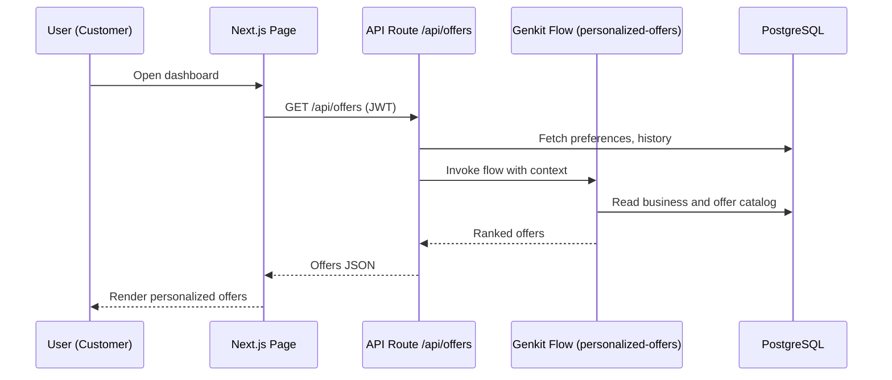
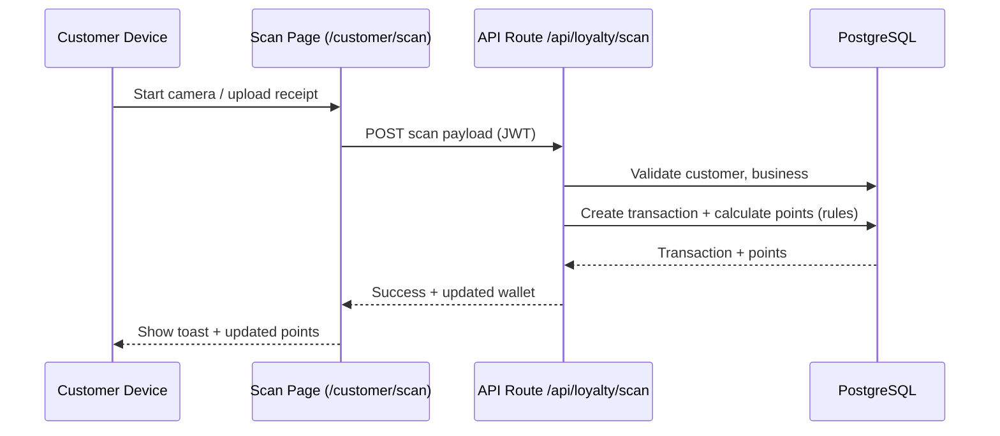

# Smart Rewards ZW – The Unified Loyalty Ecosystem
> ### Tagline: One Platform. Every Business. Every Customer.

## Core Vision
Smart Rewards ZW is a multi-tenant, AI-powered, location-based loyalty ecosystem designed to empower all Zimbabwean businesses—from the corner barber to the national supermarket chain. By combining AI, location intelligence, offline-first technology, and Zimbabwe’s own Mukando/maRound traditions, we create a connected network where loyalty is personalized, community-driven, and even financially empowering. We go beyond simple points to boost retention, drive sales in slow periods, and deliver real social and economic impact.

This prototype demonstrates the core user flows and advanced features of the platform, built with a modern Next.js frontend and a clear roadmap for a full-stack, AI-integrated backend.

---

## 1. Core Functional Modules

### Loyalty Engine
A flexible logic system to manage points, Eco-Points, service eligibility, and benefits based on tiers and milestones.

**Supported Models:**
- **Points & Tiers:** Classic point-based systems combined with tiered memberships (e.g., Bronze, Silver, Gold) that offer escalating benefits.
- **Mukando/maRound Groups:** The engine manages community savings groups, tracking contributions and payout order.
- **Gamification**: Customers can participate in challenges (e.g., "Visit 3 times this month") to earn badges and bonus points.

**Rules Based on Customer Actions:**
- **Transactions**: Earn points via QR Code scans or receipt uploads.
- **Engagement**: Earn rewards for check-ins, referrals, and social sharing.
- **Sustainability**: Awarding Eco-Points for eco-friendly actions, which can be manually adjusted by admins.

### Customer Wallet & Profile
- **Comprehensive Tracking:** A unified view of standard points, Eco-Points, shared network points, and loyalty tier status.
- **Smart Wallet Features**: The wallet includes views for transaction history, loyalty bonds (long-term value conversion), and innovative concepts like Skill-Swap and a Trust Score for micro-lending.
- **AI-Powered Segmentation:** The AI segments customers for personalized experiences and delivers targeted, context-based offers via the platform.
- **Business Discovery**: Customers can explore businesses via a filterable list or an interactive map showing nearby offers.

### Admin Dashboard
- **Program Configuration:** Business owners can configure loyalty rules, set up tiers, create offers, and define Mukando cycles.
- **Performance Monitoring:** View customer activity, track who is "following" their business, monitor redemption rates, and manage offers.
- **Manual Override Tools:** Provides tools for manually adjusting points (both loyalty and eco) and approving offers for specific customers.
- **AI Insights & Prediction:** The dashboard provides AI-driven insights, churn prediction to trigger retention campaigns, and natural language summarization of customer feedback.

---

## 2. Security Requirements
- **Authentication & Access Control:** Robust user authentication for both customers and merchants, with granular access control for the admin dashboard.
- **Data Encryption:** All sensitive data must be encrypted both in transit (HTTPS/TLS) and at rest.
- **Fraud Prevention:** AI-powered fraud detection for transactions and secure logging for all redemptions.
- **Secure APIs & Audit Logging:** All APIs must be secured. A complete audit log of all transactions and manual adjustments will be maintained.

---

## 3. AI Integration
- **Personalized Offers**: Genkit flow `personalized-offers` recommends deals based on user preferences and location.
- **Churn Detection**: Genkit flow `predict-churn` identifies at-risk customers for proactive engagement.
- **Receipt Processing**: Genkit flow `process-receipt` uses OCR to extract data from uploaded receipt images.
- **Location Verification**: Genkit flow `verify-location` uses simulated geo-fencing to validate customer check-ins.
- **Feedback Summary**: Genkit flow `summarize-feedback` analyzes and summarizes customer feedback.

---

## 4. Database Schema

This schema is designed for a full-stack Next.js application using PostgreSQL with the PostGIS extension.

### 4.1. User & Business Management

#### `users` table
- `id` (UUID, PRIMARY KEY): Unique identifier for a user.
- `email` (VARCHAR, UNIQUE): User's email.
- `password_hash` (VARCHAR): Hashed password.
- `user_type` (ENUM 'customer', 'business'): Differentiates account types.
- `created_at`, `updated_at` (TIMESTAMPTZ).

#### `customers` table
- `user_id` (UUID, PRIMARY KEY, FOREIGN KEY): Links to `users`.
- `full_name` (VARCHAR).
- `interests` (TEXT[]): For AI personalization.
- `loyalty_points` (INTEGER).
- `eco_points` (INTEGER).
- `loyalty_tier` (VARCHAR, DEFAULT 'Bronze').
- `referral_code` (VARCHAR, UNIQUE).
- `referred_by` (UUID): ID of the referrer.
- `has_premium_subscription` (BOOLEAN).
- `subscription_expiry_date` (TIMESTAMPTZ).

#### `businesses` table
- `user_id` (UUID, PRIMARY KEY, FOREIGN KEY): Links to `users`.
- `business_name` (VARCHAR).
- `business_category` (VARCHAR).
- `logo_url` (VARCHAR).
- `location` (GEOMETRY(Point, 4326)): PostGIS location.
- `shared_loyalty_id` (UUID): Links businesses into a network.

#### `customer_business_relations` table
- `customer_id` (UUID, FOREIGN KEY).
- `business_id` (UUID, FOREIGN KEY).
- PRIMARY KEY (`customer_id`, `business_id`): For following businesses.

### 4.2. Loyalty, Transactions & Offers

#### `transactions` table
- `id`, `customer_id`, `business_id` (UUID).
- `transaction_amount` (DECIMAL).
- `points_earned` (INTEGER).
- `created_at` (TIMESTAMPTZ).

#### `loyalty_rules` table
- `id`, `business_id` (UUID).
- `rule_type` (ENUM 'points', 'tier', 'milestone', 'mukando', 'eco').
- `rule_json` (JSONB): Flexible rule definitions.

#### `offers` table
- `id`, `business_id` (UUID).
- `offer_name` (VARCHAR), `description` (TEXT).
- `points_required` (INTEGER).
- `is_geo_fenced` (BOOLEAN), `geo_fence` (GEOMETRY(Polygon, 4326)).
- `active_from`, `active_to` (TIMESTAMPTZ).
- `reward_type` (VARCHAR, DEFAULT 'monetary').
- `is_coupon` (BOOLEAN), `discount_code` (VARCHAR).

### 4.3. Mukando, Gamification & AI

#### `mukando_groups` table
- `id`, `business_id`, `current_payout_user_id` (UUID).
- `group_name` (VARCHAR).
- `total_pot` (DECIMAL).

#### `mukando_contributions` table
- `id`, `group_id`, `customer_id` (UUID).
- `amount` (DECIMAL).
- `created_at` (TIMESTAMPTZ).

#### `challenges` & `customer_challenges` tables
- For tracking gamified tasks and customer progress.

#### `ai_insights` table
- Stores results from AI models like churn prediction.

### 4.4. Security

#### `audit_logs` table
- Logs manual actions like point adjustments for traceability.


## System Architecture

This document outlines the Smart Rewards ZW architecture at a glance. Diagrams are written in Mermaid so they render in GitHub and compatible viewers.

### High-Level Component Diagram
```mermaid
graph TD
  subgraph Client
    A[Web App (Next.js - CSR/SSR)]
  end

  subgraph Server
    B[Next.js API Routes]
    C[Prisma ORM]
    D[AI Flows (Genkit)]
  end

  subgraph Data
    E[(PostgreSQL / Supabase)]
    F[(Object Storage / Public Assets)]
  end

  A <--> B
  B <--> C
  C <--> E
  A --> F
  B <--> D
```

### Deployment / Networking
```mermaid
flowchart LR
  User((User)) -->|HTTPS| Nginx[Nginx Reverse Proxy]
  Nginx -->|HTTP :3000| Next[Next.js App (PM2)]
  Next -->|DB Connection| PG[(PostgreSQL)]
  Next --> Genkit[Genkit Flows]
  subgraph Host
    Nginx
    Next
    PM2[PM2 Process Manager]
  end
```

### Data Flow: Personalized Offers


### Sequence: QR Scan and Points Award


### End-to-End Journey: Login → Customer Logic → Business Admin
```mermaid
flowchart LR
  %% Swimlanes via subgraphs
  subgraph User
    U1((Customer))
    U2((Business Admin))
  end

  subgraph WebApp[Next.js Web App]
    L[Login Page]
    CD[Customer Dashboard]
    CM[Customer Map & Discovery]
    CB[Customer Badges & Gamification]
    CS[Customer Scan / Upload Receipt]
    CW[Customer Wallet]
    AM[Admin Dashboard]
    AR[Admin Rules & Tiers]
    AO[Admin Offers]
    ARD[Admin Redemption]
    AP[Admin Profile]
  end

  subgraph API[Next.js API Routes]
    AAuth[/auth/login|register|me/]
    AProf[/customers/me|preferences/]
    ADisc[/businesses|businesses/:id|follow/]
    AScan[/loyalty/scan|check-in/]
    ABadges[/customers/me/badges/check/]
    AOffers[/offers/]
    ARules[/admin/rules/]
    AAdminC[/admin/customers/]
    ARedeem[/admin/redemption/]
  end

  subgraph Services
    Gen[Genkit AI Flows\n(personalized-offers, churn, receipt, location)]
    Prisma[Prisma ORM]
  end

  subgraph Data
    DB[(PostgreSQL)]
    OBJ[(Public Assets)]
  end

  %% User → WebApp
  U1 --> L
  U2 --> L

  %% Login Flow
  L -->|POST credentials| AAuth
  AAuth -->|JWT| L
  L --> CD

  %% Customer Side
  CD -->|GET /me| AAuth
  CD -->|GET offers| AOffers
  AOffers --> Gen
  Gen --> DB
  AOffers --> CD

  CD --> CM
  CM -->|GET businesses| ADisc
  ADisc --> DB
  ADisc --> CM

  CD --> CB
  CB -->|POST badges check| ABadges
  ABadges --> DB
  ABadges --> CB

  CD --> CS
  CS -->|POST scan| AScan
  AScan --> DB
  AScan -->|award points| DB
  AScan --> CS

  CD --> CW
  CW -->|GET transactions/wallet| AProf
  AProf --> DB
  AProf --> CW

  %% Admin Side
  CD -.->|role=business| AM
  U2 --> AM
  AM --> AR
  AR -->|CRUD rules| ARules
  ARules --> DB

  AM --> AO
  AO -->|CRUD offers| AOffers
  AOffers --> DB

  AM --> ARD
  ARD -->|POST verify| ARedeem
  ARedeem --> DB

  AM --> AP
  AP -->|GET me| AAuth
  AP --> DB

  %% Shared Infra
  WebApp --> OBJ
  API --> Prisma
  Prisma --> DB
  API --> Gen
```

### Module Breakdown
- Web UI: Next.js App Router, Tailwind, client components with graceful error handling and animations
- API Layer: Next.js route handlers with JWT auth
- Data Layer: Prisma schema and client
- AI: Genkit flows for offers, churn, receipts, location
- Infra: Nginx reverse proxy, PM2, optional Supabase managed Postgres

### Environment Variables (Overview)
- DATABASE_URL, JWT_SECRET, NEXTAUTH_URL, GENKIT_ENV

### Notes
- Build memory on small droplets mitigated via swap and NODE_OPTIONS
- Camera and QR features degrade gracefully on unsupported devices


